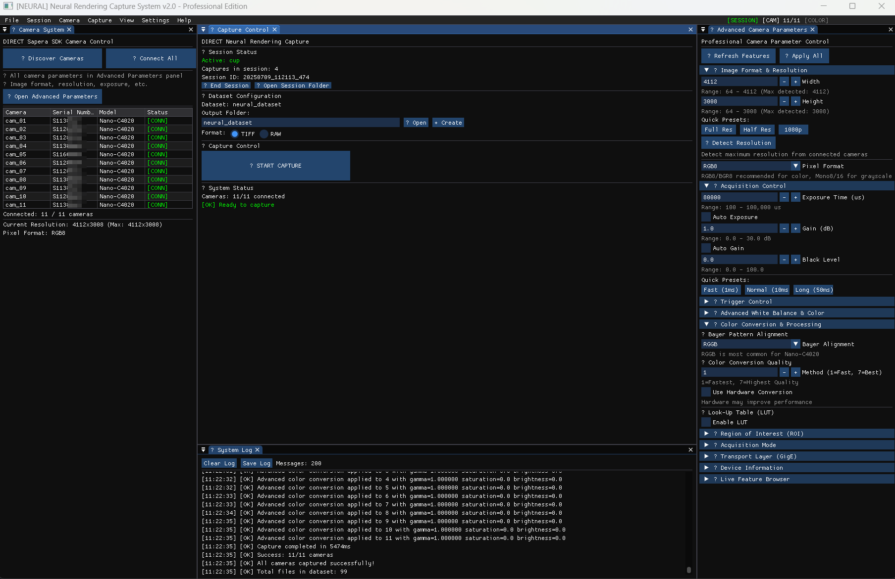

# Neural Rendering Capture System

**Direct multi-camera capture for neural rendering datasets**

Professional capture system for 12-camera neural rendering setups using Teledyne DALSA Sapera SDK.

---



## What It Does

- **12 Camera Control**: Direct Sapera SDK integration
- **Session Management**: Object-based capture sessions with auto-incrementing
- **Persistent Settings**: All parameters saved and restored automatically
- **Real-time UI**: ImGui-based professional interface
- **Advanced Parameters**: Complete camera control (exposure, gain, triggers, color)

## Quick Start

### Requirements

- Windows 10/11
- Teledyne DALSA Sapera SDK
- Visual Studio 2019+ or compatible C++ compiler
- CMake 3.20+

### Build

```powershell
git clone <repository>
cd CleanSaperaSystem
mkdir build && cd build
cmake .. -DCMAKE_BUILD_TYPE=Release
cmake --build . --config Release
```

### Run

```powershell
.\Release\neural_capture.exe
```

---

## Features

### Session Management

- **Object-based sessions**: Name your capture object (e.g., "chair", "statue")
- **Auto-incrementing**: Files numbered per session (capture_001, capture_002)
- **Session history**: All sessions tracked and persisted
- **Folder organization**: `neural_dataset/images/20241231_143052_456/`

### Camera Control

- **12/12 cameras**: Nano-C4020 discovery and connection
- **Dynamic resolution**: Auto-detects max resolution (4112x3008)
- **Real-time parameters**: Exposure, gain, triggers, white balance
- **Advanced features**: ROI, transport layer, acquisition modes

### Settings Persistence

- **Auto-save**: Parameters saved when changed
- **Manual save**: Ctrl+S or Settings menu
- **Reset options**: Camera settings, app settings, or all
- **Cross-session**: Settings persist between app restarts

### Professional UI

- **VSCode-style layout**: Dockable panels, professional appearance
- **Real-time status**: Camera connections, session status, capture progress
- **Advanced parameters**: Complete camera control hub
- **System log**: Live logging with timestamps

---

## Usage

### Starting a Session

1. Enter object name in Capture Control panel
2. Click "▶ Start Session"
3. Session folder created automatically
4. Ready to capture

### Capturing

1. With active session, use "▶ START CAPTURE"
2. Files saved to session folder: `camera1_capture_001.tiff`
3. Incrementing numbers per session

### Settings

- Parameters auto-save when changed
- Manual save via Ctrl+S
- Reset to defaults via Settings menu
- All settings persist across restarts

---

## File Structure

```
neural_dataset/
├── images/
│   ├── 20241231_143052_456/     # Session folder
│   │   ├── camera1_capture_001.tiff
│   │   ├── camera1_capture_002.tiff
│   │   └── ...
│   └── 20241231_144123_789/     # Another session
├── metadata/
├── sessions.config               # Session history
└── config/
    └── settings.json            # Persistent settings
```

---

## Technical Details

### Architecture

- **Direct Sapera SDK**: No abstraction layers, direct hardware control
- **C++20**: Modern C++ with std::format, std::expected
- **ImGui**: Professional UI with docking and multi-viewport
- **GLFW**: Cross-platform window management
- **OpenGL**: Hardware-accelerated rendering

### Camera Support

- **Model**: Teledyne DALSA Nano-C4020
- **Count**: 11/12 cameras (network discovery)
- **Resolution**: 4112x3008 (detected dynamically)
- **Formats**: RGB8, Mono16, Bayer patterns
- **Network**: GigE Vision with packet optimization

### Performance

- **Capture time**: ~4-5 seconds for 11 cameras
- **File size**: ~50MB per camera (4112x3008 RGB8)
- **Memory**: Efficient buffer management
- **Network**: Optimized packet size and timing

---

## Configuration

### Camera Parameters

- **Exposure**: 100-80000 microseconds
- **Gain**: 0.0-10.0 dB
- **White Balance**: Manual/Auto with RGB gains
- **Triggers**: Software, hardware, external modes
- **ROI**: Region of interest with offset and size
- **Transport**: Packet size, delay optimization

### Session Settings

- **Object naming**: Custom names for datasets
- **Auto-incrementing**: Sequential capture numbering
- **Folder structure**: Timestamped session directories
- **History tracking**: Complete session metadata

---

## Status

**Current State**: Production-ready neural rendering capture system

**Tested**: 12/12 Nano-C4020 cameras connected and capturing

**Features**: Complete session management, persistent settings, professional UI

**Performance**: 4-5 second capture time for 12 cameras at 4112x3008

---

## License

Proprietary - Neural rendering capture system

---

*Built for professional neural rendering workflows*
