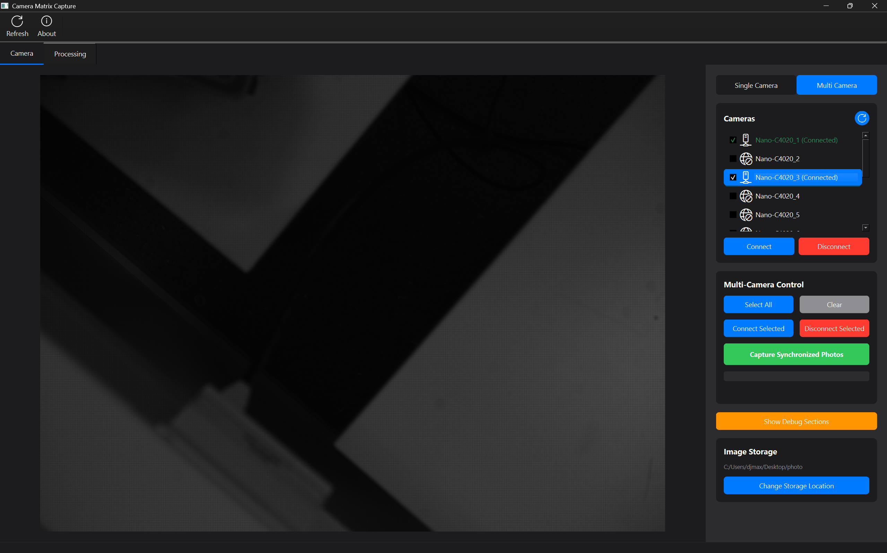

# Camera Matrix Capture

A multi-camera capture application for industrial computer vision applications. Built with Qt and the Sapera SDK.

## Features

- Single and multi-camera capture for taking pictures
- Friendly and intuitive UI
- Support for industrial cameras via Sapera SDK

## Building

This project uses CMake to manage the build process. See CMakeLists.txt for details.
